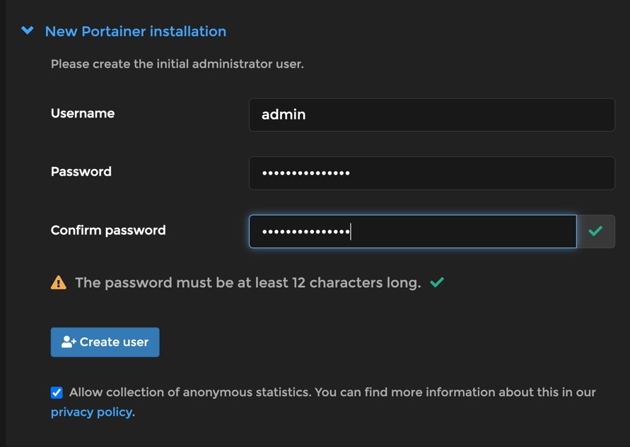

## Ansible Docker Backup Demo

This repo contains a demo of how to use the ansible roles found [in this repo](https://github.com/chatton/ansible-docker-backup)

### Prerequisites

* Have an S3 bucket and AWS S3 Access Key and Secret Key ready.
* Update the file under `host_vars/localhost.yml` to contain the credentials relevant to you.
### Install dependencies

#### Set up python virtual env

```bash
rm -r venv && python3 -m venv venv
source venv/bin/activate
pip install --upgrade pip
```

#### Install ansible and dependencies

```bash
pip install -r requirements.txt
pip install ansible
ansible-galaxy install -r requirements.yml
```

Start portainer with the following command.

```bash
docker-compose  up -d
```

Create an admin user to add some state to the volume.



Back up the volume with the ansible playbook.
```bash
ansible-playbook playbook-backup-volume.yml
```

Once this command is run, the portainer container is stopped and all volumes are backed up to S3.

simulate a disaster by removing the container and deleting the volume.
```bash
docker compose down
docker volume rm ansible-docker-backup-demo_portainer_data
```

Restore the volume from the S3 backup with a different playbook.

```bash
ansible-playbook playbook-restore-volume.yml
```


Bring portainer back up.

```bash
docker compose up -d
```

You should be able to log in with the credentials of the user you created.
